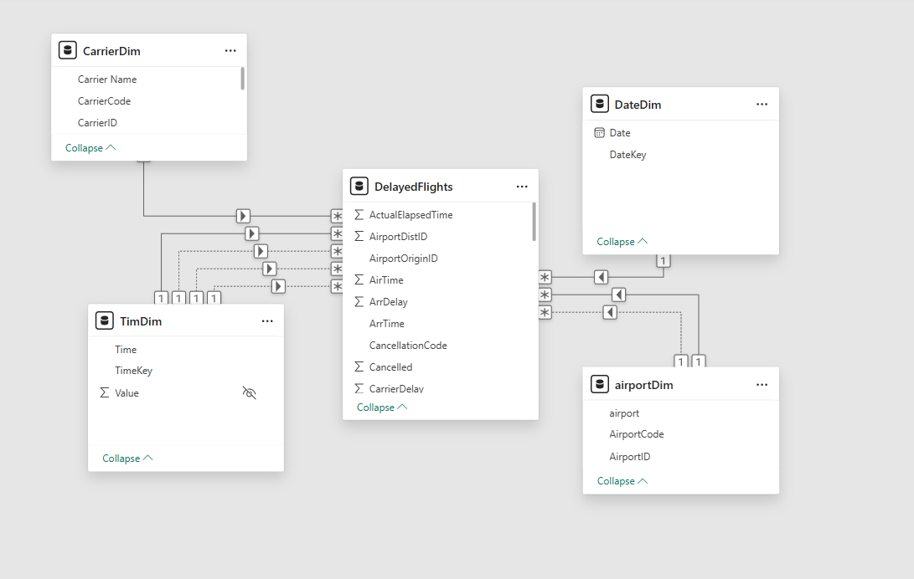
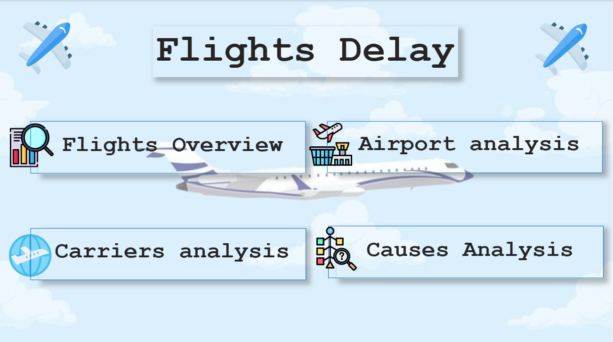
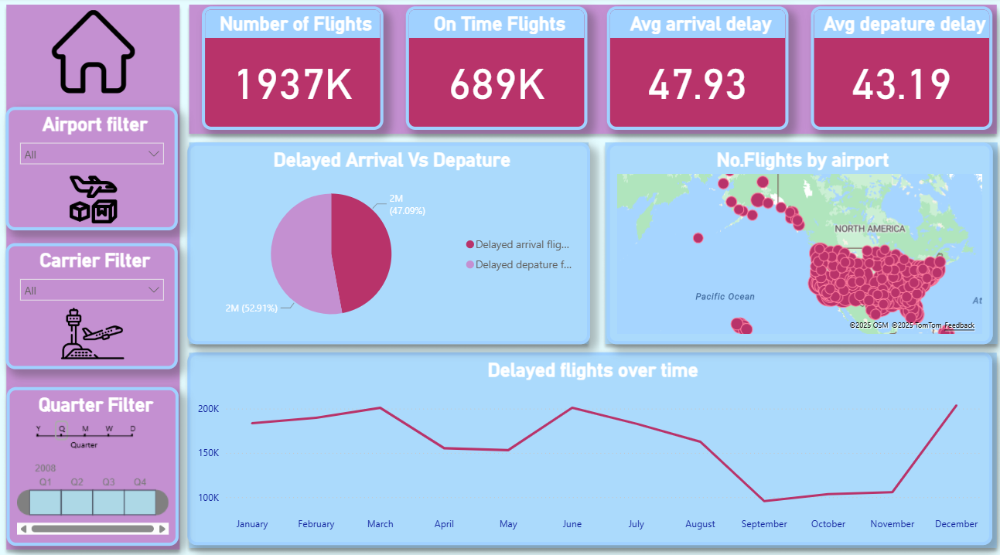
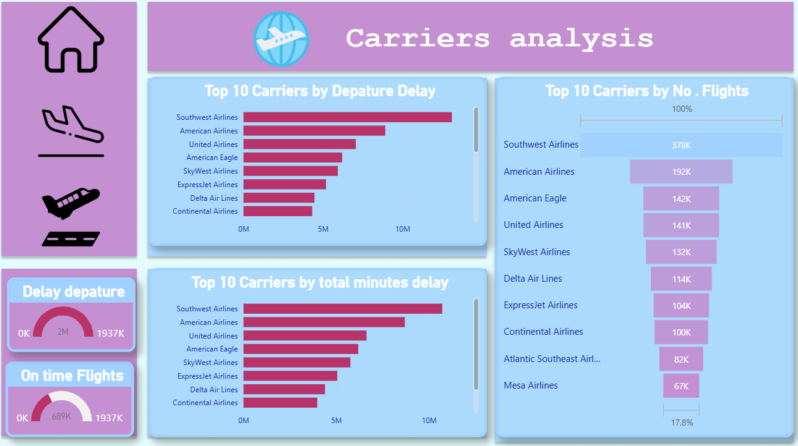
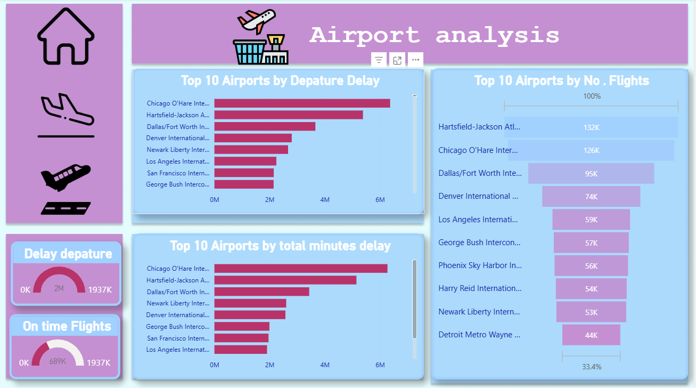
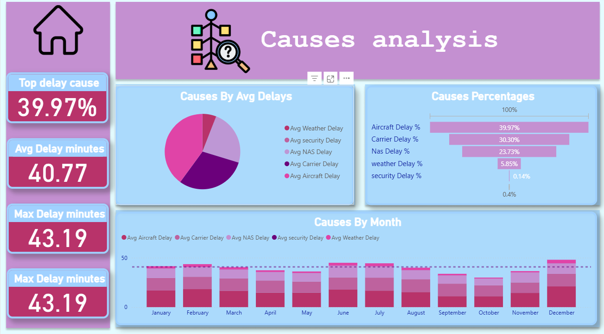
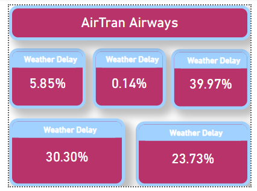

# ✈️ Flight Delay Analysis Dashboard – Power BI Project

This project was developed during my journey at the **Information Technology Institute (ITI)** as part of the Power BI Development track.

## 📊 Project Overview
The **Flight Delay Analysis Dashboard** explores flight performance across U.S. airports, airlines, and causes of delays, enabling data-driven insights into flight punctuality and operational efficiency.

---

## 📂 Dashboard Pages

1️⃣ **Flights Overview**  
   - Displays KPIs such as *On-Time Flights*, *Average Arrival & Departure Delay*, and *Total Flights Count*  
   - Trend analysis of delayed flights by month

2️⃣ **Carriers Analysis**  
   - Shows *Top 10 Airlines* by *Total Delay Minutes*, *Departure Delay*, and *Number of Flights*  
   - Highlights key players like *American Airlines*, *United Airlines*, and *Southwest Airlines*

3️⃣ **Airport Analysis**  
   - Top 10 Airports by *Total Delay Minutes* and *Number of Flights*  
   - Includes major airports such as *Chicago O’Hare* and *Atlanta Hartsfield-Jackson*

4️⃣ **Causes Analysis**  
   - Breakdown of delay causes:  
     - **Aircraft (39.9%)**  
     - **Carrier (30.3%)**  
     - **NAS (23.7%)**  
     - **Weather (5.8%)**  
     - **Security (0.1%)**  
   - Average delay time per cause by month

---

## ✨ Interactive Features
- **Drill-through filters** between dashboard pages  
- **Dynamic slicers** for Airports, Carriers, and Quarters  
- **Custom visuals** for performance comparison and delay breakdowns  

---

## 🧠 Skills & Tools
`Power BI` | `DAX` | `Data Modeling` | `Data Visualization` | `Storytelling with Data`

---
### 🧾 Model Overview

---

## 📸 Dashboard Preview
### 🧾 Home Page

---

### 🧾 Flights Overview

---

### 🛫 Carriers Analysis

---

### 🏙️ Airport Analysis

---

### ⚙️ Causes Analysis

---
### 🧾 Tooltip and Drillthrow

---

## 📁 Dataset
The dataset simulates U.S. flight records, including flight delays, carriers, and causes, to analyze operational patterns and performance.

---

## 🔗 Connect with Me
- **LinkedIn:** [Diaa Refat](https://www.linkedin.com/in/diaa-ahmed-refat/)
- **GitHub:** [DiaaRefat7](https://github.com/DiaaRefat7)
